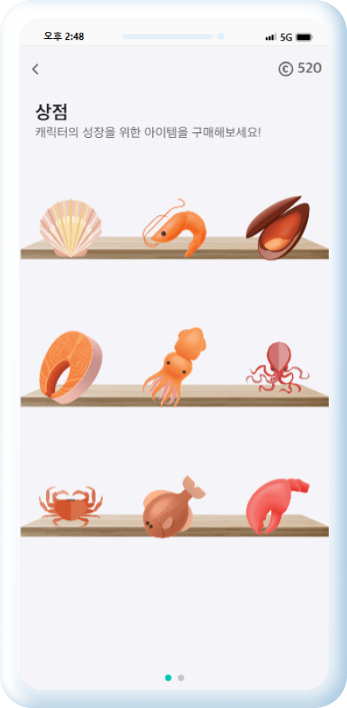
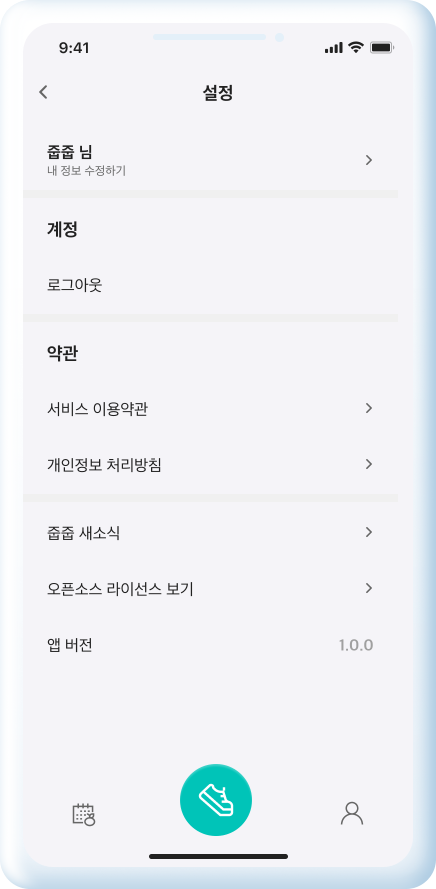

<!--
TODO
1. 어플리케이션 화면
2. (시간되면) 목차
3. 더 추가할게 있는지
-->

<!-- 대문 이미지 넣기  -->


<br/>

# 🏃‍♀️ 내 손 안의 플로깅 앱 : 줍줍 🏃‍♂️
> '나' 와  '환경'  모두를 생각하는 플로깅 어플리케이션 🌳 <br>
> 플로깅 기록을 보다 간편하게 작성해보세요 🌎<br>

<br/>
<br/>

## 🔗 배포 주소
- [app.zupzup.shop](https://app.zupzup.shop/)
<br>

## ✈️ 프로젝트 결과

### 🔗 [소개 및 시연 영상](https://youtu.be/FI77MuO2xOo)
### 🔗 [ER Diagram](https://www.erdcloud.com/d/i2qYSu9dyHPPLoYjf)
### 🔗 [Figma](https://www.figma.com/file/u6TPBskjtMDknWenvkEdVs/Design?type=design&node-id=2%3A2&mode=design&t=Spsd4gU14uSrHMu0-1)
### 🔗 [API 명세서](https://insidious-maraca-cb4.notion.site/API-d613213651e745c68eecefd876a27803?pvs=4)
### 🔗 [Presentation](./presentation/presentation.md)

<br>

## ⏰ 개발 기간
2023년 10월 10일 ~ 2023년 11월 17일

<br>


## 👩‍💻 멤버 구성
<table>
    <tr height="140px">
    <td align="center" width="60px">
            멤버
      </td>
      <td align="center" width="130px">
            <br />김주현
      </td>
      <td align="center" width="130px">
            <br />김수민
      </td>
      <td align="center" width="130px">
            <br />박소윤
      </td>
      <td align="center" width="130px">
            <br />서원호
      </td>
      <td align="center" width="130px">
            <br />서지오
      </td>
      <td align="center" width="130px">
            <br />안 나
      </td>
     <tr/>
    <tr>
        <td align="center" width="60px">
            역할
      </td>
       <td align="center" width="130px">
           팀장 / BackEnd
       </td>
       <td align="center" width="130px">
           FrontEnd
       </td>
       <td align="center" width="130px">
         BackEnd
       </td>
       <td align="center" width="130px">
         FrontEnd
       </td>
       <td align="center" width="130px">
         BackEnd / Infra
       </td>
       <td align="center" width="130px">
         BackEnd
       </td>
    </tr>
</table>

<br>

## 📌 주요 기능
**현재 위치를 활용한 플로깅**
- 메인화면에서 플로깅 바로 시작하기 가능
- 사용자 위치 실시간 조회
- 실시간 플로깅 경로, 플로깅 시간, 거리, 칼로리 확인 가능  
  <br>

**캘린더를 활용한 기록 조회**
- 캘린더를 활용하여 일별 기록 조회 가능
- 각 플로깅 기록의 거리, 시간, 칼로리, 이동경로 조회 가능
- 각 쓰레기를 통해 획득한 코인을 일일 레포트에서 확인 가능
  <br>

**쓰레기통 위치 정보 제공**
- 쓰레기통 공공데이터 활용
- 일반쓰레기통과 재활용쓰레기통 분리하여 제공
- 지도 중심좌표를 기준으로 1km 이내 쓰레기통 조회
  <br>

**Trash.ai를 활용한 쓰레기 이미지 분석**
- 쓰레기 이미지 분류 AI를 활용하여 주운 쓰레기 감지
- 60여가지 카테고리를 14개로 재범주화하여 간략화
- 측정된 쓰레기 종류의 환경오염 척도에 따라 코인 획득 가능
  <br>

**나만의 캐릭터 "펭깅" 키우기**
- 마이페이지에서 플로깅 펭귄 캐릭터 확인 가능
- 플로깅 도중 주운 쓰레기를 통해 획득한 코인으로 상점에서 아이템 구매하여 캐릭터에게 제공
- 아이템 구매시 캐릭터의 exp 증가
- 일정 exp 증가시 레벨업 후 펭귄 캐릭터 성장
  <br>

**기록 누적 레포트 제공**
- 누적 레포트 화면을 통해서 지금까지 플로깅 누적기록 조회
- 총 플로깅 횟수, 플로깅시간, 총 소모 칼로리, 각 쓰레기별 주운 개수 확인 가능
  <br>

**사용자 경험 향상**
- 직관적이고 사용하기 쉬운 인터페이스를 디자인하여 사용자의 참여를 유도
- 리워드 시스템 등을 활용하여 사용자의 활동을 지속적으로 유도
- 라이트 모드, 다크 모드 지원
- 회원가입시 튜토리얼 지원
- 사용자 의견 작성 페이지를 통해 사용자 의견 수렴 가능
- 캐릭터 키우기 설명 페이지로 사용설명 제공
  <br>

<br/>

## 🤳 화면 설명
<table>
    <tr height="140px">
        <td align="center" ></td>
        <td align="center" ></td>
        <td align="center" ></td>
        <td align="center" ></td>
    <tr/>
    <tr>
       <td align="center">🔼 소셜 로그인</td>
       <td align="center">🔼 메인 페이지</td>
       <td align="center">🔼 사용자 키, 몸무게 정보 입력</td>
       <td align="center">🔼 사용자 생년월일, 성별 정보 입력</td>
    </tr>
</table>
<br><br><br>
<table>
    <tr height="140px">
        <td align="center" > </td>
        <td align="center" > </td>
        <td align="center" > </td>
        <td align="center" > </td>
    <tr/>
    <tr>
       <td align="center">🔼 플로깅 시간, 거리, 칼로리 측정</td>
       <td align="center">🔼 플로깅 이동경로 기록</td>
       <td align="center">🔼 쓰레기통 조회 화면</td>
       <td align="center">🔼 쓰레기 분석 화면</td>
    </tr>
</table>
<br><br><br>
<table>
    <tr height="140px">
        <td align="center" > </td>
        <td align="center" > </td>
        <td align="center" > </td>
        <td align="center" > </td>
    <tr/>
    <tr>
       <td align="center">🔼 플로깅 결과 화면</td>
       <td align="center">🔼 플로깅 기록 캘린더</td>
       <td align="center">🔼 플로깅 일별 조회</td>
       <td align="center">🔼 플로깅 일일 레포트</td>
    </tr>
</table>
<br><br><br>
<table>
    <tr height="140px">
        <td align="center" > </td>
        <td align="center" > </td>
        <td align="center" > </td>
        <td align="center" > </td>
    <tr/>
    <tr>
       <td align="center">🔼 마이페이지(라이트 모드)</td>
       <td align="center">🔼 마이페이지(다크 모드)</td>
       <td align="center">🔼 다음 레벨</td>
       <td align="center">🔼 누적 레포트</td>
    </tr>
</table>
<br><br><br>
<table>
    <tr height="140px">
        <td align="center" > </td>
        <td align="center" > </td>
        <td align="center" > </td>
        <td align="center" > </td>
    <tr/>
    <tr>
       <td align="center">🔼 상점</td>
       <td align="center">🔼 아이템</td>
       <td align="center">🔼 아이템 구매</td>
       <td align="center">🔼 설정화면</td>
    </tr>
</table>
<br><br><br>


## 📌 기술스택
&nbsp;&nbsp;&nbsp;&nbsp; **🛠 Frontend Develop** <br>


&nbsp;&nbsp;&nbsp;&nbsp; **🛠 Backend Develop** <br>


&nbsp;&nbsp;&nbsp;&nbsp; **🛠 DataBase** <br>


&nbsp;&nbsp;&nbsp;&nbsp; **🛠 Infra** <br>


&nbsp;&nbsp;&nbsp;&nbsp; **🛠 SCM** <br>


<br>

## 👨‍💻 Structure
### ✍ Back-End 
**◼ Package Structure**
``` text
├── board
│   ├── 📂 controller
│   │   ├── 📂 dto
│   │   │   ├── 📂 request
│   │   │   │   └── BoardListRequest
│   │   │   └── 📂 response
│   │   │       └── BoardListResponse
│   │   └── BoardController 
│   ├── 📂 service
│   │   └── BoardService
│   ├── 📂 domain
│   ├── 📂 repository
│   │	├── BoardSpringDataRepository
│   │	└── BoardQueryRepository
│   └── 📂 exception
├── member
│   ├── 📂 controller
│   ├── 📂 application
│   ├── 📂 persistence
│   ├── 📂 domain
│   └── 📂 exception
├── Application
```

<br>

### ✍ Front-End
**Directory structure**
<br>
``` text
├── public
│   ├── index.html
│   └── web.config
├── src
│   ├── 📂 api
│   ├── 📂 assets
│   │   ├── 📂 images
│   │   ├── 📂 font
│   ├── 📂 router
│   ├── 📂 components
│   ├── 📂 hooks
│   ├── 📂 pages
│   ├── 📂 styles
│   ├── 📂 utils
│   ├── vite-env.d.ts
│   ├── App.tsx
│   └── main.tsx
├── .eslintrc.cjs
│── .gitignore
├── .prettierrc
├── package.json
├── tsconfig.json
├── tsconfig.node.json
├── yarn.lock
└── vite.config.js
```

<br/>

## 🎊 Git Commit Convention
**💡 Commit Type**
- 커밋 메시지는 타입과 제목으로 구성되고, 태그는 영어로 쓰되 *첫 문자는 소문자*로 한다.
- `타입: 제목` 형태이며 `:` *뒤에만 space가 있음*에 유의한다.
- 타입
    - `feature`: 새로운 기능 추가
    - `fix` : 오류 수정
    - `docs` : 문서 수정
    - `style` : 코드 포맷팅, 세미콜론 누락, 코드 변경이 없는 경우, 주석추가 및 수정
    - `refactor` : 코드 리펙토링
    - `test` : 테스트 코드, 리펙토링 테스트 코드 추가
    - `chore` : 위에 걸리지 않는 기타 변경사항(빌드 스크립트 수정, assets image, 패키지 매니저 수정 등)
    - `hotfix` : 긴급 수정 사항
    - `rename` : 파일 혹은 폴더명 수정, 옮기기
    - `remove` : 파일 삭제

## 🎃 Git Flow 전략 (Branch)
**💡 git flow 과정**
- master 브랜치에서 develop 브랜치를 분기합니다.
- 개발자들은 develop 브랜치에 자유롭게 커밋을 합니다. 도안
- 기능 구현이 있는 경우 develop 브랜치에서 `feature/{fe|be}-{#issue-number}` 브랜치를 분기합니다.
- 배포 전 테스트는 develop 브랜치에서 진행한 후 master에 merge합니다.
    - `master`: 기준이 되는 브랜치로 서비스를 배포하는 브랜치
    - `develop`: 개발 브랜치로 개발자들이 이 브랜치를 기준으로 각자 작업한 기능들을 Merge
    - `feature`: 단위 기능을 개발하는 브랜치로 기능 개발이 완료되면 develop 브랜치에 Merge


